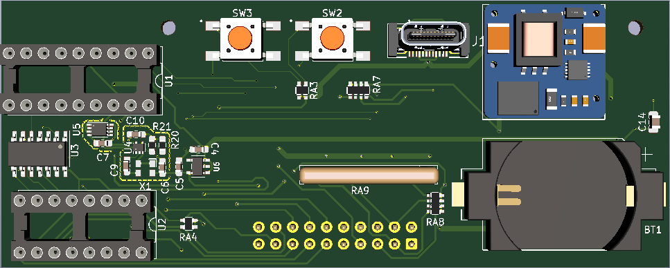

# PIC-nixie #
Design of a simple yet accurate Nixie clock controlled by a single-chip MCU. No arduino. 

For IN-14 or IN-8-2 Nixie neon tubes. 

The socket PCB plugs into the logic board to make an 'L' shape.

The time is displayed on four tubes with MUX-ed cathodes. The digits are output in binary-coded decimal for interfacing with the K155ID1 driver. Anodes and the colon bulb (12:34) are also controlled by the PIC through BJT-pMOS level shifters.

The program correctly tracks time such that the bottle-neck for clock accuracy will be the external oscillator. Anode blanking was implemented to ensure fast transitions on the Nixie tubes without ghosting (with help from a Zener diode). The clock will also run an outgassing routine every hour to prevent "cathode poisoning" and even out wear & tear to ensure a long tube life.

A CR2032 battery can be installed on the circuit board to provide backup power in the event of an outage. The tubes may go dark but the MCU will continue to run and keep time for about 11 hours until power is restored.

## Design

The PCB assembly is housed in a 'C'-shaped enclosure, which obscures the tops of the neon tubes. The design was developed in collaboration with my friend [Donald Swen](https://www.dswenn.com/projects/2019/11/27/22-Design.html) at Stanford's Design School. The idea is that, by hiding the pointed tops of the IN-14 tubes, the finished clock can achieve a symettry that would normally only be possible with IN-12 bulbs. With this clock shape, the vertical digits appear to be floating seamlessly within a cylinder. PIC-Nixie is the first neon tube clock to incorporate this aesthetic design principle.

The enclosure for the #0 prototype was made from stacked slabs of Fraké wood. The clock was a gift for my grandpa.
